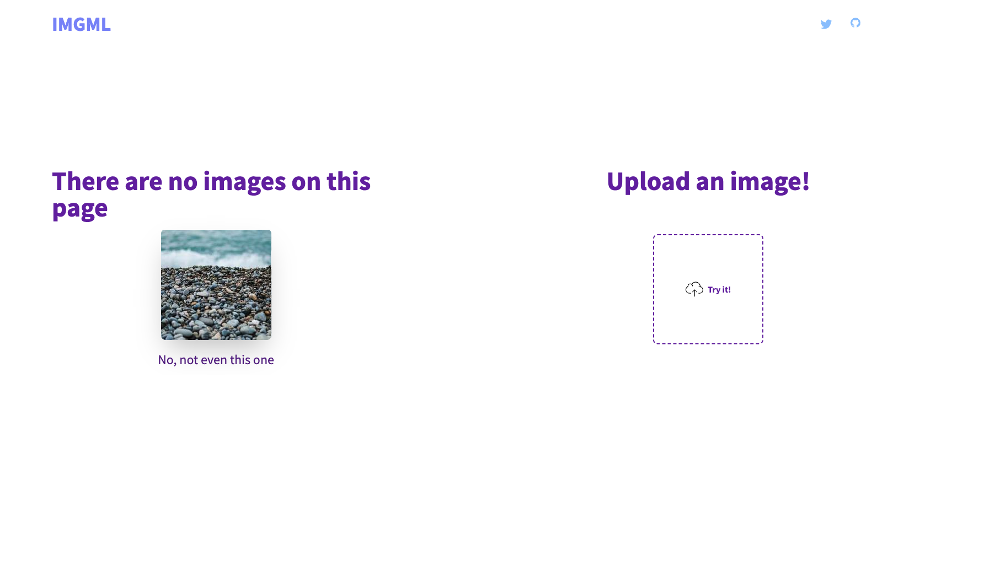

## IMGML

IMGML is a service for converting JPEG image files to an imageless HTML file, using elements with a 1 x 1 pixel size and a background color matching each of the image's pixels. This is very stupid an inefficient and it's not intended to be used as a serious solution.

## License
Do what you want with it. Let me know if you find any cool application for this.


### Example HTML

```html
<row>
        <hr style="background:rgb(152,179,170)">
        <hr style="background:rgb(158,184,175)">
        <hr style="background:rgb(163,189,180)">
        <hr style="background:rgb(169,192,182)">
        <hr style="background:rgb(174,198,185)">
        <hr style="background:rgb(179,201,189)">
        <hr style="background:rgb(182,204,192)">
        <hr style="background:rgb(186,208,195)">
        <hr style="background:rgb(190,210,198)">
        <hr style="background:rgb(193,213,201)">
        <hr style="background:rgb(196,216,204)">
        <hr style="background:rgb(199,219,207)">
        <hr style="background:rgb(201,221,209)">
        <hr style="background:rgb(206,224,212)">
        <hr style="background:rgb(209,227,215)">
        <hr style="background:rgb(210,228,216)">
        <hr style="background:rgb(210,228,216)">
        <hr style="background:rgb(210,228,216)">
```




